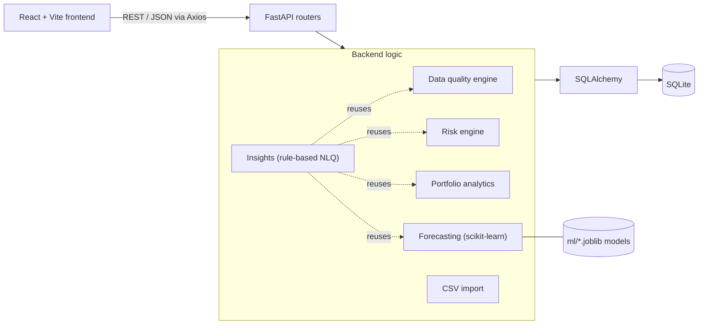

# PropLens

A commercial real-estate portfolio analytics app: dashboards, lease monitoring, data-quality checks, explainable risk scoring, ML forecasting, CSV import, and a rule-based natural-language query layer. Built with FastAPI and React on synthetic demo data.

> **All data in this repository is synthetic.** It is generated by `backend/app/seed_data.py` for demonstration and does not represent any real property, tenant or company.

## Overview

PropLens is a student project that models the kind of questions a real-estate portfolio team asks every day:

- Which properties need attention, and why?
- Which leases expire in the next 90 days?
- How much can we trust the data behind these numbers?
- Where are revenue and occupancy heading?

It combines a small analytics backend with a dashboard-style frontend. Risk scores are built from a transparent weighted formula rather than a black-box model, so every score can be traced back to its inputs. Data-quality checks run before numbers are reported, and CSV uploads are validated before anything is written to the database.

It is intended as a portfolio/learning project. It is not a production system (see [Limitations](#limitations)).

## Key Features

- **Portfolio dashboard**: 7 KPI cards (properties, portfolio value, annual revenue, average occupancy, high-risk properties, leases expiring in 90 days, data-quality score) and 6 charts.
- **Property browser**: search by name or city, filter by city, property type and risk category, sortable columns, pagination.
- **Property detail**: financial metrics, NOI, risk score with a factor-by-factor breakdown and plain-language reasons, tenants, leases, and 12-month revenue and occupancy history.
- **Lease monitoring**: lease status (Active / Expiring Soon / Expired) and days-to-expiry are computed from dates at read time, not stored.
- **Data quality engine**: rule-based detection across properties, tenants and leases, a weighted quality score, persisted issues, and drill-down by category.
- **Risk engine**: five weighted factors normalized to 0-100, mapped to Low / Medium / High.
- **Portfolio analytics**: revenue growth, NOI, NOI margin, operating expense ratio, and breakdowns by city and property type.
- **ML forecasting**: scikit-learn Random Forest models for monthly revenue and occupancy, evaluated with a time-aware split.
- **CSV import**: upload and validate a properties CSV (optionally with a tenant and lease per row); all-or-nothing database write for the rows that pass validation.
- **AI Insights (rule-based)**: ask questions in plain English; answers are computed by the existing analytics, risk, data-quality and forecasting code. It is not an LLM (see [below](#natural-language--ai-insights)).

## Tech Stack

| Area | Technology (version from `requirements.txt` / `package.json`) |
|---|---|
| Frontend | React 18, Vite 5, React Router 6, Axios |
| Styling | Tailwind CSS 3 |
| Charts | Recharts 2 |
| Backend | Python, FastAPI 0.115, Uvicorn 0.30, Pydantic 2.9, pydantic-settings |
| Database / ORM | SQLite (default, the only database tested), SQLAlchemy 2.0 |
| Data processing | pandas 2.2, NumPy 1.26 |
| Machine learning | scikit-learn 1.5 (`RandomForestRegressor`), joblib |
| File upload | python-multipart, Python `csv` module |
| Testing | No automated test suite yet (see [Testing](#testing)) |

`psycopg2-binary` is listed in `requirements.txt` and the database URL is configurable, but PostgreSQL has not been tested.

## System Architecture



- The frontend talks to the backend only through one API client module (`frontend/src/api/client.js`).
- Each router in `backend/app/api/` is thin. The logic lives in `analytics/`, `ml/` and `services/`.
- The dashboard, analytics API, forecasting and AI Insights all call the same analytics functions, so the same number is not calculated two different ways.
- The CSV importer and the data-quality engine share the same validation predicates (`is_invalid_occupancy`, `is_negative`, `is_invalid_date_range`, `is_location_mismatched`).

## Core Modules

| Module | Location | What it does |
|---|---|---|
| Data quality engine | `backend/app/analytics/data_quality.py` | Runs the rule set over the database, persists findings, computes the score |
| Risk engine | `backend/app/analytics/risk_engine.py` | Computes the five risk factors, the weighted score, category and reasons |
| Portfolio analytics | `backend/app/analytics/portfolio_analytics.py` | Portfolio totals, NOI, growth, and breakdowns; reused by dashboard, analytics API, forecasting and AI Insights |
| Forecasting | `backend/app/ml/` | Feature building, training/evaluation, iterative multi-month forecasts |
| CSV import | `backend/app/services/csv_import.py` | Parse, validate and transactionally insert uploaded rows |
| AI Insights | `backend/app/services/ai_insights.py` | Intent matching plus retrieval from the modules above |
| Lease status | `backend/app/utils/lease_status.py` | `days_to_expiry` and the Active / Expiring Soon / Expired rule |

Lease status rule: `days_to_expiry < 0` is Expired, `<= 90` is Expiring Soon, otherwise Active.

## Risk Scoring

Each property gets five factor scores, each normalized to 0-100 (higher means riskier), combined with fixed weights:

```
score = 0.30*occupancy + 0.25*lease_expiry + 0.20*revenue_trend
      + 0.15*opex + 0.10*data_quality
```

| Score | Category |
|---|---|
| 0-39 | Low |
| 40-69 | Medium |
| 70-100 | High |

| Factor (weight) | How the 0-100 value is chosen |
|---|---|
| Occupancy (30%) | Missing: 65. Out of range (<0 or >100): 100. Below 50%: 100, below 65%: 75, below 80%: 45, below 90%: 20, otherwise 5 |
| Lease expiry (25%) | No dated leases: 50. Any expired lease: 100. Otherwise by nearest upcoming expiry: within 60 days 90, within 90 days 70, within 180 days 40, within 365 days 20, later 5 |
| Revenue trend (20%) | Compares the average of the last 3 months with the 3 months before. Fewer than 6 months of history: 40. Change of -15% or worse: 100, -5% or worse: 65, up to +5%: 30, up to +15%: 15, above +15%: 5 |
| Operating expenses (15%) | Opex / revenue ratio. Above 60%: 100, above 45%: 60, above 30%: 30, otherwise 10. Missing or non-positive revenue: 50 |
| Data quality (10%) | `min(100, 40 x number of data-quality issues recorded for that property)` |

Where a factor triggers a message (for example "Occupancy below 65%" or "Revenue declined 22% over the last 3 months"), it is attached as a reason. The top three reasons, ranked by weighted contribution, are returned with the score. The score is a hand-tuned rule set, not a trained model, and the thresholds have not been calibrated against real outcomes.

`GET /api/risk/properties` runs a full scan and stores `risk_score` and `risk_category` on each property row. The property list and detail endpoints compute the score live.

## Data Quality Engine

`GET /api/data-quality` clears and re-runs all rules against the current database, stores each finding in the `data_quality_issues` table, and returns the score plus category counts. `GET /api/data-quality/issues` lists the stored issues (filterable by issue type and entity type), and the Data Quality page uses it for drill-down.

**Rules implemented**

| Rule | Applies to |
|---|---|
| Missing values (`city`, `state`, `area_sqft`) | Properties |
| Duplicate tenants (same tenant name under different IDs) | Tenants |
| Invalid occupancy (<0 or >100) | Properties |
| Negative `annual_revenue` or `property_value` | Properties |
| Negative `annual_rent` | Leases |
| Lease end date before start date | Leases |
| Revenue outliers (IQR method, 1.5 x IQR, on absolute `annual_revenue`) | Properties |
| City/state mismatch against a lookup of 8 known Indian cities | Properties |
| Duplicate property IDs | Always 0 in the database scan because `id` is the primary key. Duplicate IDs are caught during CSV import instead |

**Score:** start at 100 and subtract, per category, `min(cap, issue_count x per_issue_weight)`:

| Category | Points per issue | Cap |
|---|---|---|
| Missing values | 0.5 | 15 |
| Duplicates | 2.0 | 10 |
| Invalid values (occupancy and negatives) | 2.0 | 20 |
| Date issues | 3.0 | 10 |
| Outliers | 1.0 | 10 |
| Location mismatch | 2.0 | 10 |

The caps stop one category from dragging the score to zero on its own. The seed data deliberately contains issues, so a freshly seeded database scores about 56 (29 issues found). That is expected for the demo dataset.

## Machine Learning Forecasting

> The models are trained on synthetic data. Reported accuracy describes how well they fit this fictional dataset and should not be read as real-world predictive performance.

- **What is forecast:** monthly revenue and monthly occupancy, for the whole portfolio (per-property forecasts are available through the API).
- **Model:** `RandomForestRegressor` (200 trees, `max_depth=8`, `min_samples_leaf=3`, `random_state=42`), one model per target.
- **Features:** previous month's value (`lag_value`), calendar month, property type (encoded), city (encoded), operating expense.
- **Training data:** one row per property per month from `property_metrics`. Rows without a target or without a usable previous value are dropped. Missing values inside a series are forward-filled only for the lag and expense features.
- **Validation:** time-aware. The most recent 2 months across all properties are held out as the test set and the model is trained only on earlier months. After evaluation the model is refit on all data for forecasting. The reported metrics come from the holdout.
- **Forecasting:** iterative one-step-ahead. Each predicted month becomes the lag input for the next, for 1-12 months. Portfolio revenue is the sum of property forecasts and portfolio occupancy is their average. Occupancy is clamped to 0-100 and operating expense is held at its last known value.

Held-out metrics observed with the default seed:

| Target | MAE | RMSE | R² | Train / test rows |
|---|---|---|---|---|
| Revenue (per property-month) | about ₹186,000 | about ₹336,000 | 0.996 | 1,350 / 299 |
| Occupancy | about 2.0 pts | about 2.5 pts | 0.978 | 1,345 / 300 |

**Why the numbers look so good, and why not to trust them:**
- The synthetic series are smooth month to month, so "last month's value" is already a strong predictor.
- In the generator, monthly operating expense is derived from that month's revenue, so `operating_expense` leaks information about the target. Feature importances show it roughly on par with the lag feature.
- There are only about 11 usable months per property.

Trained models are saved to `ml/*.joblib` (git-ignored) and created automatically on the first forecast request. They are reloaded, not retrained, when the data changes. Delete the `.joblib` files to force a retrain.

## Natural Language / AI Insights

**This feature is deterministic and rule-based. It is not a generative AI system and makes no calls to any LLM.** No API key is needed.

How a question is answered:

1. **Intent matching.** The text is checked for a property reference first (a property ID like `PROP0046`, or a property name matched by substring or word overlap). If none is found, ordered regex rules select a portfolio-level intent.
2. **Retrieval.** The matching handler calls the existing functions (`portfolio_financials`, `revenue_growth`, `run_risk_scan`, `compute_property_risk`, `run_data_quality_scan`, `forecast_portfolio`, `forecast_property`) or queries the property/tenant/lease tables directly.
3. **Response.** A string template turns the retrieved values into a sentence. The response also carries `category`, `source` (which function or table produced it), `supporting_data`, and `records` where relevant.

If nothing matches, it returns an "unsupported" answer instead of guessing. If the question references a property that cannot be resolved, it returns "not found".

**Supported questions**

| Topic | Example |
|---|---|
| Portfolio KPIs | "What is the total portfolio value?", "What is the total revenue?", "What is the NOI?", "What is the occupancy rate?" |
| Risk | "Which properties are high risk?", "Why is PROP0046 high risk?" |
| Leases | "Which leases are expiring soon?", "What are the tenants and leases for PROP0001?" |
| Data quality | "What is the data quality score?", "What are the main data quality problems?" |
| Trend and forecast | "What is the revenue trend?", "What does the revenue forecast show?", "6 month occupancy forecast" |
| Property lookup | "Tell me about PROP0001" |

`GEMINI_API_KEY` exists as an optional setting in `config.py`, but no Gemini integration is implemented. See the limitations below for what the matcher gets wrong.

## CSV Import

`POST /api/import/csv` (multipart upload, also available on the **CSV Import** page).

- **Input:** a UTF-8 `.csv` file (BOM accepted), up to 5 MB, with a header row. One row is one property.
- **Required columns:** `id`, `name`
- **Optional columns:** `city`, `state`, `property_type`, `area_sqft`, `occupancy_pct`, `annual_revenue`, `operating_expenses`, `property_value`, `tenant_name`, `lease_start`, `lease_end`, `annual_rent`
- **Dates:** `YYYY-MM-DD` (also `MM/DD/YYYY` and `DD-MM-YYYY`)

Example:

```csv
id,name,city,state,property_type,area_sqft,occupancy_pct,annual_revenue,operating_expenses,property_value,tenant_name,lease_start,lease_end,annual_rent
DEMO001,Demo Tower A,Chennai,Tamil Nadu,Office,50000,85,25000000,9000000,200000000,Example Tenant Ltd,2025-01-01,2027-01-01,4500000
```

**Validation (all before any database write)**

| Result | Conditions |
|---|---|
| Row rejected | Missing `id` or `name`; duplicate property ID within the file or already in the database; duplicate tenant name within the file or already in the database; occupancy outside 0-100; negative revenue, property value or rent; lease end before lease start; non-numeric value in a numeric column; unrecognized date |
| Warning (row still imported) | Missing `city` or `state`; city/state pair that doesn't match the known lookup |

The occupancy, negative-value, date-range and city/state checks call the same functions the data-quality engine uses.

**Transaction behaviour:** rows that pass validation are added in a single transaction and committed once. If any exception occurs during insertion, the session is rolled back and none of the rows are imported. Rejected rows never reach the database. If some rows are rejected, the valid rows are still imported and the response status is `partial`. A structural problem (wrong file type, unreadable encoding, missing required columns, empty file, file over 5 MB) returns HTTP 400.

**What gets created:** a `properties` row per valid row and, if `tenant_name` is present, a tenant, plus a lease when any lease field is given. Tenant and lease IDs are generated (`TEN-IMP-…`, `LSE-IMP-…`).

**Response:** status (`success`, `partial`, `rejected`, `empty`, `error`), total/valid/rejected row counts, imported property IDs, and row-level issues with row number, field and message.

**Current limitations:** properties only (no separate tenant or lease files); no update of existing properties, since a matching ID is rejected; no monthly history is imported, so imported properties have no forecast or trend data; tenant duplicates are detected by exact name only.

## Database

SQLite by default (`backend/proplens.db`), managed through SQLAlchemy models. Tables are created on backend startup if missing.

| Table | Purpose | Relationships |
|---|---|---|
| `properties` | Property attributes, financials, occupancy, stored `risk_score` and `risk_category` | Parent of the tables below |
| `tenants` | Tenant name and industry | `property_id` references `properties.id` |
| `leases` | Start/end dates, annual rent, renewal status | `property_id` references `properties.id`; `tenant_id` references `tenants.id` |
| `property_metrics` | Monthly revenue, occupancy and operating expense per property | `property_id` references `properties.id` |
| `data_quality_issues` | Findings from the last data-quality scan | Refers to an entity by `entity_type` and `entity_id`, with no foreign key |

Lease status is derived from `lease_end` and is not stored.

## API

Interactive documentation is served by FastAPI at `http://localhost:8000/docs`.

| Method | Endpoint | Purpose |
|---|---|---|
| GET | `/api/health` | Health check |
| GET | `/api/dashboard/summary` | KPI cards and chart data |
| GET | `/api/properties` | List with `search`, `city`, `property_type`, `risk_category`, `sort_by`, `sort_dir`, `page`, `page_size` |
| GET | `/api/properties/{property_id}` | Property detail with tenants, leases, 12-month history |
| GET | `/api/properties/meta/filters` | Cities, types and risk categories for filter dropdowns |
| GET | `/api/leases` | Leases with computed status; filter by `status` or `property_id` |
| GET | `/api/data-quality` | Run the scan; score and category counts |
| GET | `/api/data-quality/issues` | Stored issues; filter by `issue_type`, `entity_type` |
| GET | `/api/risk/properties` | Run the risk scan; ranked properties with reasons |
| GET | `/api/risk/properties/{property_id}` | Factor-by-factor risk breakdown |
| GET | `/api/analytics/portfolio` | Revenue, opex, NOI, margins, growth, breakdowns |
| GET | `/api/analytics/revenue` | Monthly revenue trend and growth |
| GET | `/api/analytics/occupancy` | Monthly occupancy trend and occupancy by type |
| GET | `/api/forecast/revenue` | Revenue forecast (`horizon_months` 1-12, optional `property_id`) |
| GET | `/api/forecast/occupancy` | Occupancy forecast (same parameters) |
| POST | `/api/import/csv` | Validate and import a properties CSV |
| POST | `/api/insights/ask` | Ask a natural-language question (`{"question": "..."}`) |
| GET | `/api/insights/examples` | Example questions and the active answering engine |

## Frontend Pages

| Route | Page | Contents |
|---|---|---|
| `/` | Dashboard | KPI cards; revenue trend, occupancy trend, revenue by city, property-type mix, risk distribution, lease expirations by month |
| `/properties` | Properties | Search, filters, sortable table, pagination, risk badges |
| `/properties/:id` | Property detail | Metrics, NOI, risk breakdown and reasons, history charts, tenants, leases |
| `/leases` | Leases | Status filter, sorting, days to expiry, pagination |
| `/data-quality` | Data Quality | Overall score, category cards, filterable list of affected records |
| `/risk` | Risk | Category distribution, risk-ranked list with reasons, expandable factor values |
| `/analytics` | Analytics | Financial KPIs, trends, breakdowns by city and type, and a portfolio forecast panel (revenue or occupancy, 3/6/12 months) with holdout metrics |
| `/import` | CSV Import | Drag-and-drop upload, validation summary, row-level issues |
| `/insights` | AI Insights | Question box, example questions, answer with supporting data and records |

## Project Structure

```
Proplens/
├── backend/
│   ├── app/
│   │   ├── main.py              # FastAPI app, CORS, router registration
│   │   ├── config.py            # Settings from environment / .env
│   │   ├── database.py          # Engine, session, get_db dependency
│   │   ├── seed_data.py         # Synthetic data generator (run manually)
│   │   ├── models/              # SQLAlchemy models
│   │   ├── schemas/             # Pydantic response/request schemas
│   │   ├── api/                 # Route modules (one per feature)
│   │   ├── analytics/           # data_quality, risk_engine, portfolio_analytics
│   │   ├── ml/                  # features, train, forecast
│   │   ├── services/            # csv_import, ai_insights
│   │   └── utils/               # lease_status
│   └── requirements.txt
├── frontend/
│   ├── src/
│   │   ├── api/client.js        # Single API client
│   │   ├── components/          # Layout, KPI cards, badges, pagination, forecast panel
│   │   ├── pages/               # One file per page
│   │   └── utils/format.js
│   ├── package.json
│   └── .env.example
├── ml/                          # Trained models, generated at runtime (git-ignored)
├── .env.example
└── .gitignore
```

`backend/proplens.db` and `ml/*.joblib` are generated files and are git-ignored.

## Getting Started

### Prerequisites

- **Python 3.10-3.12** (developed on 3.12; the pinned NumPy 1.26.4 has no Python 3.13 wheels)
- **Node.js 18+** (developed on Node 22) and npm
- Git

### Backend Setup (Windows)

```bat
git clone https://github.com/Tagore10/Proplens.git
cd Proplens\backend
python -m venv venv
venv\Scripts\activate
pip install -r requirements.txt
```

In PowerShell, activate with `venv\Scripts\Activate.ps1`. If scripts are blocked, run `Set-ExecutionPolicy -Scope Process Bypass` first, or use Command Prompt.

On macOS/Linux the activation command is `source venv/bin/activate`.

### Database / Seed Data

Run these from the `backend` folder. The SQLite path is relative to the working directory, so running from elsewhere would create a second, empty database.

```bat
python -m app.seed_data
```

The seed script **drops and recreates all tables** before inserting data, so do not run it on a database that contains data you want to keep, including imported CSV rows. It uses a fixed random seed (42) and produces 150 properties, 223 tenants, 300 leases and 1,800 monthly metric rows, with a set of deliberately injected data-quality problems (missing values, invalid occupancy, negative values, city/state mismatches, revenue outliers, duplicate tenant names, reversed lease dates, negative rent). Lease dates are generated relative to today's date, so lease statuses and risk numbers shift over time.

Starting the API without seeding creates empty tables.

### Optional Configuration

Defaults work without any configuration. To override, copy the example file into the `backend` folder as `.env`:

```bat
copy ..\.env.example .env
```

| Variable | Default | Purpose |
|---|---|---|
| `DATABASE_URL` | `sqlite:///./proplens.db` | Database connection string (only SQLite has been tested) |
| `CORS_ORIGINS` | `http://localhost:5173,http://localhost:3000` | Allowed frontend origins |
| `GEMINI_API_KEY` | empty | Currently unused |

### Running the Backend

```bat
uvicorn app.main:app --reload
```

API: http://localhost:8000 - Swagger docs: http://localhost:8000/docs

### Frontend Setup

In a second terminal:

```bat
cd Proplens\frontend
npm install
npm run dev
```

App: http://localhost:5173

The frontend calls `http://localhost:8000` by default. To change it, copy `frontend\.env.example` to `frontend\.env` and edit `VITE_API_BASE_URL`.

### Production Build (frontend only)

```bat
npm run build
```

## Testing

**There is no automated test suite in this repository yet.** No pytest, no frontend tests, and no CI.

During development I checked behaviour manually with scripts that are not committed:

- API responses were compared against each other (for example, AI Insights answers against the dashboard, analytics, risk and forecast endpoints).
- The CSV import was exercised with test files covering valid, malformed, missing-column, duplicate-ID, invalid-occupancy, negative-value, invalid-date, mixed and empty cases.
- The rollback path was checked against a disposable copy of the database using a forced primary-key collision.
- Pages and interactions were driven in headless Chrome.

A quick manual check after setup:

```bat
curl http://localhost:8000/api/health
```

then open `/docs` and try `GET /api/dashboard/summary`. Turning these checks into a pytest suite is listed under [Future Improvements](#future-improvements).

## Example Use Cases

- **Find high-risk properties:** open **Risk**, filter to High, and expand a row to see the factor values. The property page shows the reasons, such as occupancy below 50% or expired leases.
- **Check expiring leases:** open **Leases**, filter by *Expiring Soon*, and sort by lease end.
- **Investigate data quality:** open **Data Quality**, click a category card such as Invalid Values, and follow the property links.
- **See trends:** the **Dashboard** and **Analytics** pages show 12 months of revenue and occupancy.
- **Forecast:** on **Analytics**, switch the forecast panel between revenue and occupancy and choose a 3, 6 or 12 month horizon.
- **Ask a question:** on **AI Insights**, try "Why is PROP0046 high risk?" or "Which leases are expiring soon?".
- **Import data:** upload a properties CSV on **CSV Import** and review any rejected rows.

## Data

The dataset is fictional and generated by `backend/app/seed_data.py`. It uses Indian city names and property types (Office, Retail, Industrial, Logistics, Mixed Use) to look plausible, and includes different occupancy levels, a seasonal bump in November and December, properties with rising or falling trends, expiring leases, and deliberately injected errors so the data-quality and risk features have something to detect. It does not contain real company, tenant or market data.

## Limitations

**Data and ML**
- All data is synthetic. The forecast metrics reflect smooth generated series, and operating expense is derived from revenue in the generator (leakage), so the metrics say little about real-world accuracy.
- Only about 11 usable months of history per property; forecasts compound error over longer horizons and hold operating expense constant.
- Saved models are not retrained automatically when data changes (after re-seeding or importing, delete `ml/*.joblib`). The UI forecast panel is portfolio-level only.

**Scoring logic**
- Risk weights and thresholds are hand-chosen, not calibrated. A single expired lease sets the lease-expiry factor to 100 regardless of `renewal_status`.
- The data-quality risk factor reads the issues stored by the last scan, so it can be stale until a scan runs.
- The city/state check only knows 8 cities. The data-quality scan's duplicate-property-ID rule is always 0 (enforced by the primary key).

**AI Insights**
- Keyword matching only. Qualifiers such as a city or property type are ignored: "What is the occupancy for Mumbai?" returns the portfolio-wide average.
- Ranking or comparison questions are not supported: "Which city has the highest revenue?" returns total revenue instead of a ranking.
- Questions containing words like "property" or "park" without a resolvable property can return "not found" (for example, "What is the average property value?").
- Count questions ("How many properties are there?") are unsupported.
- No LLM integration exists.

**Engineering**
- No automated tests, CI, Docker setup or deployment. No authentication or authorization.
- Only SQLite has been run. Some `GET` endpoints write to the database (the data-quality scan rewrites `data_quality_issues`, the risk scan updates `properties`, and the dashboard triggers a data-quality scan). Everything is recomputed on each request, which is fine at 150 properties but would not scale.
- CSV import handles properties only and cannot update existing records.
- On small screens the sidebar is hidden and there is no mobile navigation menu yet. The frontend ships as a single JS bundle (about 680 kB before gzip).

## Future Improvements

These are not implemented.

- Add a pytest suite (risk factors, data-quality rules, CSV import including rollback, lease status, API smoke tests) and a frontend test setup.
- Add Docker and docker-compose, and test against PostgreSQL.
- Add authentication and role-based access.
- Replace request-time scans with scheduled jobs and cached results; keep GET endpoints read-only.
- Improve the NLQ layer: entity and filter extraction (city, type), ranking questions, and optionally an LLM used only to phrase already-retrieved facts.
- Improve forecasting: real data sources, backtesting over rolling windows, expense forecasting, model versioning and drift monitoring.
- Support lease and tenant CSV imports, upserts, and import of monthly metrics.
- Add a mobile navigation menu and code-splitting on the frontend.

## Screenshots

_Screenshots are not included yet._ To add them, place images in a `docs/screenshots/` folder and reference them here, for example:

```markdown

```

Suggested captures: Dashboard, Property detail (risk breakdown), Data Quality, Analytics with the forecast panel, CSV Import result, AI Insights.

## Engineering Decisions

- **FastAPI:** Pydantic models validate request and response shapes, and the interactive `/docs` page makes each endpoint easy to try and demonstrate.
- **React + Vite + Recharts:** a plain SPA with one API client module keeps network code out of the components.
- **SQLAlchemy:** the models are database-agnostic and the URL comes from configuration. SQLite keeps setup to zero, and it is the only database that has been tested.
- **A separate analytics/risk layer:** the dashboard, analytics endpoints, forecasting and AI Insights call the same functions, so one calculation has one implementation. The shared validation predicates are the same idea applied to data quality and CSV import.
- **Rule-based risk score instead of a model:** with synthetic data and no ground-truth labels there is nothing to train on. A weighted formula with per-factor reasons can be explained line by line.
- **Time-aware ML validation:** holding out the most recent months matches how a forecast is used. A random split would let neighbouring months of the same property leak between train and test.
- **CSV validation before database writes:** invalid rows are filtered out first, and the remaining rows go in as one transaction, so a failure cannot leave a half-imported file.

## Resume-Friendly Summary

- Built a full-stack commercial real-estate portfolio analytics app (React, FastAPI, SQLAlchemy, SQLite) with 9 pages covering dashboards, property and lease views, and 18 REST endpoints, run against a synthetic dataset of 150 properties.
- Implemented a rule-based data-quality engine (8 rule types, weighted score with per-category caps, persisted issues) and an explainable 5-factor risk score with per-property reasons.
- Trained Random Forest models (scikit-learn) to forecast portfolio revenue and occupancy, using a time-aware train/test split and iterative multi-month forecasting, and documented the limits of evaluating on synthetic data.
- Built a validated CSV import with duplicate detection and all-or-nothing database writes, plus a deterministic natural-language query layer that answers questions by calling the existing analytics, risk, data-quality and forecasting code.

## Author

Tagore Sri Ram Gowthu - B.Tech (AI & ML) - [GitHub: Tagore10](https://github.com/Tagore10)
